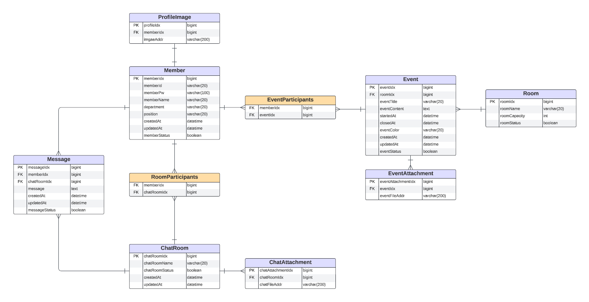

### 기술스택

#### &nbsp;　[ Backend ]

&nbsp;&nbsp;&nbsp;</a></a>
&nbsp;&nbsp;&nbsp;</a></a>
&nbsp;&nbsp;&nbsp;</a></a>
&nbsp;&nbsp;&nbsp;&nbsp;</a></a>

### 프로젝트 설계
 

  

    
<b>ERD</b>
 
        
  

 

### 소프트웨어 아키텍처 - 모놀리식

<b>MVC 패턴</b>

* 정의
  * Model, View, Controller라는 3가지 구성 요소로 이루어진 소프트웨어 엔지니어링 아키텍처 패턴 
  1. 모델(Model)
     * 데이터와 비즈니스 로직을 처리. 
     * Controller에게 받은 데이터를 가공하는 역할을 수행
  2. 뷰(View)
     * 사용자 인터페이스 요소. 
     * Controller에게 받은 Model의 데이터를 사용자에게 시각적으로 보여주기 위한 역할을 수행
  3. 컨트롤러(Controller)
     * Model과 View 사이에서 데이터 흐름을 제어
     * 사용자가 접근한 URL에 따라 요청을 파악하고 URL에 적절한 Method를 호출하여 Service에서 비즈니스 로직을 처리
    
* 장점
  * 유지보수성
  * 재사용성 및 확장성
  * 개발 효율성
* 단점
  * 복잡성 증가 : 규모가 복잡하고 큰 서비스 및 프로그램의 경우, 하나의 Controller에 많은 View와 Model이 연결되어 있기 때문에 부하가 커지게 된다.
  * 상호의존성 : Model과 View의 의존성을 완전히 분리시킬 수 없다.
 

<b>레이어드 아키텍처</b>

* 정의
  * 소프트웨어 설계를 위한 일반적인 아키텍처 패턴 중 하나
  * 애플리케이션을 명확하게 구분된 여러 계층으로 나누는 방식
  1. 프레젠테이션 계층 (Presentation Layer)
     * 사용자 인터페이스(UI)와 사용자 경험(UX)을 담당
     * 사용자의 입력을 받아 처리하고, 사용자에게 정보를 시각적으로 표현
  2. 비즈니스 로직 계층 (Business Logic Layer)
     * 데이터의 처리 및 변환, 계산, 비즈니스 규칙의 실행 등을 담당
     * 애플리케이션의 핵심 기능과 비즈니스 규칙을 구현
  3. 퍼시스턴스 계층 (Persistence Layer)
     * 데이터를 생성, 읽기, 업데이트, 삭제(CRUD)하는 로직을 관리하는 계층
     * 데이터를 영구 저장소에 저장하고 필요할 때 해당 데이터를 검색
  4. 데이터 계층 (Database Layer)
      * 실제 데이터를 저장하는 계층
* 장점
* 단점

 

### 주요 기능

<b>멤버</b>

<b>채팅</b>

* WebSocket
  * 양방향 통신을 가능하게 하는 기술
  * 서버와 클라이언트 간에 지속적인 연결을 유지하며 데이터를 실시간으로 양방향으로 교환

* STOMP(Simple Text Oriented Messaged Protocol)
  * pub/sub 구조를 따르는 텍스트 기반의 프로토콜
  * 클라이언트와 메시지 브로커 간의 비동기 통신을 위해 설계
  * Subscriber, Sender, Broker를 따로 두어 처리
    1. Subscriber : Subscriber는 채팅방으로부터 메시지를 받기 위해 Broker에 구독 신청
    2. Sender : Sender는 메시지를 생성해서 채팅방에 발행하는 역할. 메시지는 Broker를 통해 Subscriber에게 전달
    3. Broker : Sender로부터 메시지를 받아 해당 메시지를 Subscriber에게 전달

     

* WebSocket vs STOMP
* Kafka vs RabbitMQ
* Kafka vs Redis
* MongoDB vs MariaDB

<b>일정</b>

<b>알람</b>

* SSE
  * 

* Spring Batch
  * 

