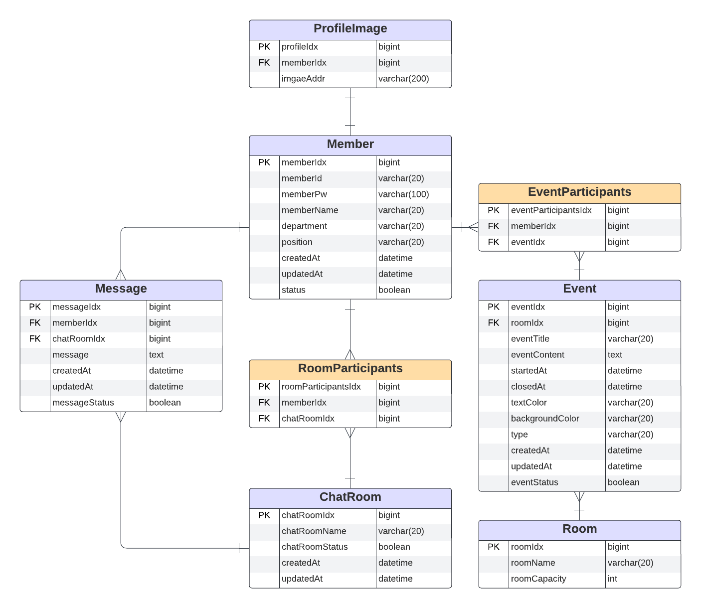
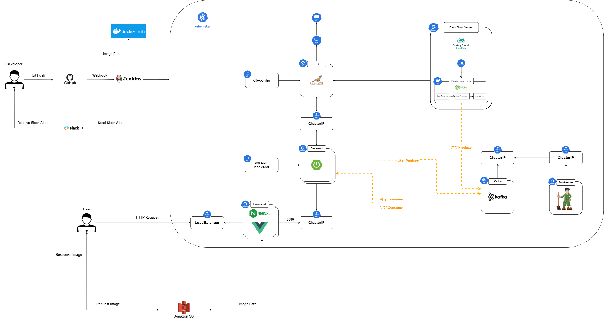

### :sunny: **[플레이 데이터] 한화시스템 BEYOND SW캠프 2기 / Latest** :sunny:

 

 

### 🤼‍♂️팀원 소개

  

&nbsp;　&nbsp;　&nbsp;　&nbsp;　&nbsp;　&nbsp;　&nbsp;　&nbsp;　 🐻 **[이동규](https://github.com/PTCman)**&nbsp;　 🦁 **[양호신](https://github.com/Hosae0905)** &nbsp;　 🐶 **[김주연](https://github.com/jyk147369)** &nbsp;　 🐯 **[장대현](https://github.com/poil4291)** &nbsp;
   

## ✨ 프로젝트 기본 소개
#### 프로젝트 배경
- 기업의 규모가 커질 수록 각 직원들 또는 부서간 소통을 하기 위한 협업툴은 필수적이다.
- 많은 외부 툴들이 있지만 회사보안 및 내규상 외부서버를 이용하지 않고 자체서버 프로그램이 필요한 회사들 입장에서는 회사에 맞는 협업툴이 반드시 필요하다.

#### 프로젝트 목표
- 직원들의 **개인일정 및 그룹일정을 등록 및 확인**한다. 
- **그룹 간 의사소통을 주고 받을 수 있는 채팅방**을 개설 하여 상호소통한다.
- 그룹일정 시 **회의실 예약**을 할 수 있다.
- 등록된 **일정 시간이 다가오면 서버측에서 알림**을 보내 직원이 일정을 상기한다.

 

### :rainbow: 시연사이트 바로가기
#### :arrow_right: [www.ssm23.kro.kr](http://www.ssm23.kro.kr)

---

## 📌 기술 스택

 

#### :door:&nbsp;Front

 

#### :computer:&nbsp;Back

 
 
 

#### :floppy_disk:&nbsp;DB

 

#### :loudspeaker:&nbsp;CI/CD

#### 🚀 TEST Tools

 

---

## :one:&nbsp;&nbsp;프로젝트 화면 설계

### &nbsp;&nbsp; :large_orange_diamond: &nbsp;[ 피그마(Figma) 바로가기](https://www.figma.com/file/xj93UowlHUunCPSqImxspk/LAT32T?type=design&node-id=0-1&mode=design&t=itaxJcadJzP1pjEG-0)

 

## :two:&nbsp;&nbsp;요구사항 정의서
### &nbsp;&nbsp; :large_orange_diamond: &nbsp;[ 요구사항정의서 바로가기](https://docs.google.com/spreadsheets/d/121T1XodlKwX98hXcoRJmiMPKQaZVn3RyZAUTDPQm5UY/edit?usp=sharing)

 

## :three:&nbsp;&nbsp;WBS
### &nbsp;&nbsp; :large_orange_diamond: &nbsp;[ WBS 바로가기](https://docs.google.com/spreadsheets/d/1CyA0HzYGfK01-JZf1aBc4vodGZ1Olf65/edit?usp=drive_link&ouid=106833420462517191298&rtpof=true&sd=true)

 

##  :four:&nbsp;API 명세서

### &nbsp;&nbsp; :large_orange_diamond: &nbsp;[ API 명세서 바로가기](https://www.notion.so/0d57403fe28943c3997598c0de35ceb9?v=f54966510f6c4223b61c64146d9c1940&pvs=4)

 

## :five: &nbsp;&nbsp;ERD

<b>ERD보기</b>
 
    

 

 

## :six: &nbsp;시스템 아키텍처

<b>시스템아키텍쳐 보기</b>
 

## :seven: &nbsp;기타 설명

---

### 👉&nbsp;&nbsp;Front
- LoadBalacer type의 서비스에 의해 외부에 연결되어 있다.
- nginx의 Reverse Proxy를 통해 front주소 /api가 붙어 있으면 k8s안의 Backend Service에 연결한다.
- 채팅 및 알람 기능은 연결을 지속적으로 유지하기 위해 http1.1이상 규격을 사용해야하며 nginx가 Reverse proxy 적용시 http1.1을 유지 하게 한다.
- 채팅의 경우 header가 http에서 ws로 upgrade 할 수 있도록 설정한다.
- Deployment로 k8s에서 작동하며 부하분산을 위해 2개의 pod로 운영된다.
- RollingUpdate 방식으로 무중단 배포 된다.

#### 🤔 [ Frontend 설명 더보기 ](https://github.com/beyond-sw-camp/be02-fin-LAT32T-SSM/tree/develop/frontend)
 

### 👉&nbsp;&nbsp;Back
- SCDF에 의해 batch서버가 1분에 한번씩 pod로 작동하며, 이때 회원의 일정을 조회를 해서 메세지를 produce 하여 Cluster Ip를 통해 kafka broker로 전달한다. kafka broker는 Backend 서버에게 메세지를 전달하며, Backend는 메세지를 consume 하여 Frontend에게 SseEmitter를 통해 데이터를 전송한다.
- Deployment로 k8s에서 작동하며 부하분산을 위해 2개의 pod로 운영된다.
- 2개의 서버의 websocket session이 서로 달라 채팅 데이터가 누락이 될 수 있어, 채팅 메세지가 생성되면 kafka broker에게 전달하고 그 메세지를 2개의 서버가 consume한다.
- RollingUpdate 방식으로 무중단 배포 된다.
- Front, DB, kafka와 cluster ip로 통신하여 외부에 노출되지 않는다.

#### 🤔 [ Backend 설명 더보기 ](https://github.com/beyond-sw-camp/be02-fin-LAT32T-SSM/tree/develop/backend)
 

### 👉&nbsp;&nbsp;CI/CD
- 개발자 Github에 push하게 되면, webhook에 의해 Jenkins가 작동한다.
- Jenkins는 pipeLine script에 따라 git cloone, build, docker image build, docker image push의 과정을 거치고 manifest 파일을 k8s master 서버 전송 후 deployment를 실행한다.

#### 🤔 [ CICD 설명 더보기 ](https://github.com/beyond-sw-camp/be02-fin-LAT32T-SSM/tree/develop/cicd)

---