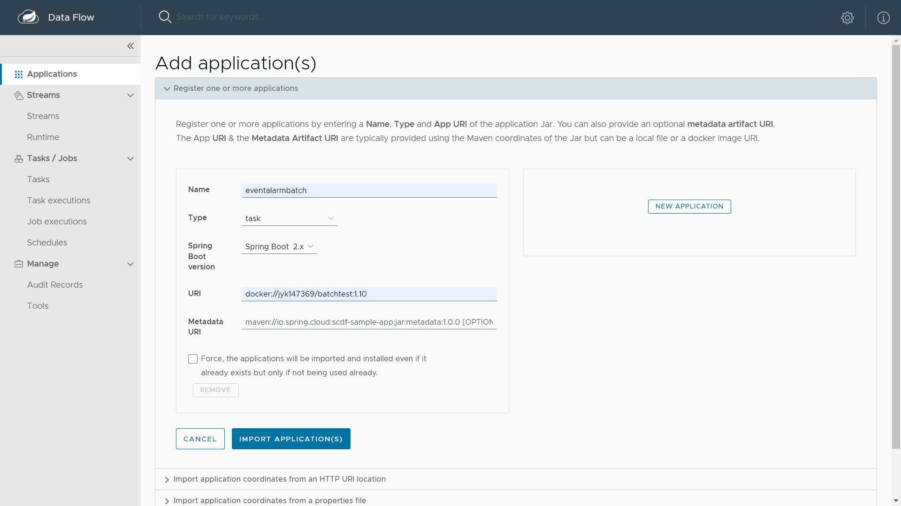

### :sunny: **[플레이 데이터] 한화시스템 BEYOND SW캠프 2기 / Latest** :sunny:

 

 

### 🤼‍♂️팀원 소개

  

&nbsp;　&nbsp;　&nbsp;　&nbsp;　&nbsp;　&nbsp;　&nbsp;　&nbsp;　 🐻 **[이동규](https://github.com/PTCman)**&nbsp;　 🦁 **[양호신](https://github.com/Hosae0905)** &nbsp;　 🐶 **[김주연](https://github.com/jyk147369)** &nbsp;　 🐯 **[장대현](https://github.com/poil4291)** &nbsp;
   

## 📌 기술 스택

 

#### :computer:&nbsp;Back

 

 

 

### 소프트웨어 아키텍처

<b>MVC 패턴</b>

* Model, View, Controller라는 3가지 구성 요소로 이루어진 소프트웨어 엔지니어링 아키텍처 패턴

   
 

<b>레이어드 아키텍처</b>

* 소프트웨어 설계를 위한 일반적인 아키텍처 패턴 중 하나

   

> * MVC 패턴
> 1. 명확한 역할 분담으로 효과적인 협업이 가능해서 짧은 시간동안 안정적인 프로그램을 신속하게 개발할 수 있음
> 2. 모델 컴포넌트는 다른 시스템에서도 재사용 가능
> 3. 개발 과정이 병렬적으로 진행될 수 있어 프로젝트 전체의 개발 속도를 높일 수 있다.
> 
> * 레어어드 아키텍처
> 1. 각 계층이 특정 역할을 담당함으로써 개발과정이 간소화되고 테스트및 후속 확장이 용이해서 개발 비용과 시간을 절약할 수 있음
> 2. 각 계층은 다른 애플리케이션에서도 재사용 가능
> 3. 팀 별로 계층을 나누어 개발할 수 있어 프로젝트 관리가 효율적
>
> ➡️ 유지보수성, 재사용성, 확장성, 개발용이성을 고려하여 MVC 패턴, 레이어드 아키텍처가 채택되었다.

 

### 주요 기능

<b>일정</b>

### ✅ 일정 기능

> SSM 사용자는 일정을 등록, 조회, 삭제하는 기능들을 이용하여 보다 쉽게 효율적인 일정 관리를 할 수 있다.

* **일정 등록 기능**
  * 사용자는 일정 제목, 일정 시작 시간, 일정 종료 시간, 일정 내용, 일정 참가자, 채팅방 이름, 회의실 등의 데이터를 입력하여 일정을 등록할 수 있다.
     
* **일정 월별 조회 기능**
  * 사용자는 자신의 개인 일정을 조회할 수 있다.
  * 사용자는 같은 채팅방에 존재하는 사용자의 일정을 내 일정과 조회할 수 있다.
     
* **일정 상세 조회 기능**
  * 사용자는 원하는 날짜의 일정을 개별 조회할 수 있다.
     

<b>회의실</b>

> SSM 사용자는 원하는 시간에 원하는 회의실을 예약함으로써 효과적으로 프로젝트 협업을 진행할 수 있고, 현재 회의실 사용 유무와 예약 내역을 조회할 수 있어 더욱 체계적으로 협업 일정을 계획할 수 있다.

* **회의실 예약 기능**
  * 원하는 날짜 및 시간에 회의실이 공실일 경우 예약이 가능하다.
  * 예약이 완료된 회의실은 다른 사용자가 예약할 수 없다.
  * 회의실 예약 성공 시
     
  * 해당 시간에 회의실이 이미 예약이 된 경우 예약 실패
     
* **회의실 예약 내역 조회**
  * 회의실에 예약된 일정들을 볼 수 있다.
     
* **현재 회의실 조회**
  * 현재 사용 중인 회의실과 미사용 중인 회의실을 조회할 수 있다.
  * 회의실 예약 전 회의실 현황 조회
     
  * 회의실 예약 등록
     
  * 회의실 예약 후 회의실 현황 조회
     

### ✅ QueryDSL을 사용한 필터링

> 일정 상세 조회, 월간 조회나 회의실 예약 조회, 회의실 현황 조회 등 다양한 조회 기능을 구현함으로써 사용자 일정에 대한 접근 용이성과 효율성을 높이고자 하였다.

* **QueryDSL**
  * 쿼리 생성에 특화된 프레임워크
  * QueryDSL 동작 방식
   

* **QueryDSL vs JPQL**
  * 타입 안정성 체크가 가능
    * JPQL은 문자열이기 때문에 문법이 틀려도 개발자가 알아차리기 어렵다. 따라서 타입 안정성이 떨어지지만 QueryDSL은 자체적인 프로세스에서 JPQL 생성을 대신하여 타입 안정성 체크가 가능하다. 
  * 직관적인 동적 쿼리 작성 가능
    * QueryDSL은 빌더 패턴 구조로 으로 가독성 있는 데이터 세팅이 가능하고 쿼리 작성시 제약 조건 등을 메서드 추출을 통해 재사용할 수 있지만 JPQL은 문자열을 조작하는 방식으로 로직을 구성해야 하므로 코드가 직관적이지 않고 가독성이 떨어진다.
    * 같은 기능을 QueryDSL과 JPQL로 구현했을 때 비교
      * JPQL
          
      * QueryDSL ️➡️ 빌더패턴 구조로 코드 가독성이 더 높다.
         
       
> 코드의 가독성과 유지보수성을 고려하여 QueryDSL을 사용하여 조회 기능을 구현했다.

<b>채팅</b>

### ✅ WebSocket과 STOMP를 이용한 채팅 기능 구현

> 실시간 채팅은 사내 사용자들간 소통을 향상시켜 일의 효율도를 높이고 프로젝트에 대한 적극적인 참여를 유도할 수 있을 것이라 고려되어 구현하게 되었다. 

* **WebSocket**
    * 하나의 TCP 연결을 통해 양방향 통신을 가능하게 하는 프로토콜 기술
  * 서버와 클라이언트 간에 지속적인 연결을 유지하며 데이터를 실시간으로 양방향으로 교환
  * 

* **STOMP(Simple Text Oriented Messaged Protocol)**
  * pub/sub 구조를 따르는 텍스트 기반의 프로토콜
  * 클라이언트와 메시지 브로커 간의 비동기 통신을 위해 설계
  * Subscriber, Sender, Broker를 따로 두어 처리
    1. Sender : Sender는 메시지를 생성해서 채팅방에 발행하는 역할. 메시지는 Broker를 통해 Subscriber에게 전달 ➡️ 채팅방 생성
    2. Subscriber : Subscriber는 채팅방으로부터 메시지를 받기 위해 Broker에 구독 신청 ➡️ 채팅방 입장
    3. Broker : Sender로부터 메시지를 받아 해당 메시지를 Subscriber에게 전달 ➡️ 채팅방에서 메시지 송수신

     

* **WebSocket과 STOMP**
  * STOMP는 WebSocket 위에서 동작
  * WebSocet만으로 채팅을 구현할 경우 해당 메시지가 어떤 요청인지, 어떤 포맷으로 오는지, 메시지 통신 과정을 어떻게 처리해야 하는지 정해져 있지 않으므로 메시지 형식을 각각 커스터마이징해야 함.
  * 하지만 STOMP는 메시지의 형식, 유형, 내용 등을 정의해주는 프로토콜이므로 규격을 갖춘 메시지를 보낼 수 있다.
  * MessageMapping 어노테이션을 이용해 메시지를 엔드포인트 별로 분리해서 관리할 수 있다. 
     
    > SSM은 일정 참여자들의 일정을 등록하고 관리하는 그룹 채팅방이 필요했기에 STOMP로 채팅 기능을 고도화 시켰다.

<b>알람</b>

### ✅ SSE(Server-Sent-Events)을 활용한 알람 기능 구현

> 일정에 대한 사용자의 참여도와 상호작용을 향상시키고, 중요한 정보나 기한을 놓치지 않도록 하는 알람기능을 추가했다.. 

* **SSE**
  * 서버의 데이터를 실시간으로, 지속적으로 Streaming 하는 기술
  * SSE 동작 방식
     
* **SSE vs FCM(Firebase Cloud Messaging)**
  1. 간단한 서버-클라이언트 통신 구현
     * SSE는 HTTP 표준을 기반으로 한 간단한 방식으로 구현이 가능하지만 FCM은 Firebase 계정 설정, 프로젝트 생성, 애플리케이션 등록 등 초기 설정 과정이 필요하다.
  2. 표준 웹 기술 사용
     * SSE는 HTTP 프로토콜을 사용하므로 별도의 서비스나 프레임 워크에 의존하지 않는다. 따라서 추가적인 비용없이 기존의 사내 웹 인프라와 통합이 가능하다. 반면에 FCM는 Google 인프라에 종속적이다.
  3. 네트워크 부하감소
     * SSM은 사용자의 일정에 대한 알람 뿐만 아니라 그룹 일정에 종속되어 있는 사용자들에 대한 알람, 채팅에 대한 알람 기능이 구현되어 있으므로 알람 기능에 대한 부하가 생길 수 있다. SSE는 클라이언트가 서버에 반복적으로 요청을 보내지 않아도 되기 때문에 네트워크 부하를 줄일 수 있다.
  4. 뛰어난 실시간성
     * SSE는 서버와 클라이언트의 단방향 데이터 스트림이므로 즉각적인 알람이 가능하여 일정과 채팅에 실시간으로 응답할 수 있다. 반면 FCM은 장치 연결 상태, 메시지의 크기와 포맷, 네트워크 상태 등 전송 시간이 지연될 수 있는 요소들이 존재하여 SSE보다 실시간성이 떨어진다. 

### ✅ Spring Batch

> 기존 @Scheduled 어노테이션을 사용한 스케줄링 방식으로 서버의 부하가 발생하여 Spring Batch를 톻해 알람 기능을 구현하였다.
* 기존의 서비스 코드로는 서버의 부하로 인해 안정적인 서비스 제공이 어렵다고 판단하였다.
  

      배치 적용 전
 
* **Spring Batch**
  1. 역할 분리
     * Job, Step, Tasklet을 통해 역할을 분리하여 각각의 역할에 맞게 구현하였다.
  2. 부하분산
     * 하나의 백엔드 서버 내에서 모든 알람을 처리하던 방식에서 독립적인 배치 서버를 구축하여 알람을 처리하는 부하를 분산시켰다.
     * 부하 분산을 통해 기존 메인 서버의 부하를 줄이고 배치 서버에서 오류가 발생했을 때 영향을 최소화하여 안정적인 서비스를 제공할 수 있다.
     * 스케줄러는 k8s 클러스터 내에서 실행시키기 위해 Spring Cloud Data Flow를 사용하여 크론 잡으로 실행하였다.
    

      배치 적용 후

### ✅ Spring Cloud Data Flow
> 대량의 일정 알림 Spring Batch 프로그램을 일정 주기로 k8s 클러스터 내에서 실행하기 위해 스케줄러로 크론 잡을 사용하였다. 
* **@Scheduled**
  * @Scheduled 어노테이션을 사용한 스케줄링 방식은 서버의 메모리를 많이 사용하고, 서버의 부하를 발생시키는 원인이 되었다.

* **Spring Cloud Data Flow**
  * 기존에 사용했던 @Scheduled 방식에서 벗어나 Kubernetes 환경에서 일괄 처리 파이프라인을 구축하고 대규모 데이터 처리 작업을 스케줄링하는 마이크로서비스 기반 툴킷 

* **SCDF vs @ Scheduled**
  1. 확장성
     - 클라우드 환경에서 작업을 스케줄링하고 실행하는 데 있어, 여러 인스턴스로 쉽게 확장할 수 있다. 이는 데이터베이스에 등록된 대량의 일정에 대해 알람을 보내는 배치작업에 유리하다.
  2. 유연성 및 관리 용이성
     - SCDF는 복잡한 워크플로우를 쉽게 만들고 관리할 수 있는 대쉬보드를 제공함으로써 작업을 더 효과적으로 모니터링 할 수 있다.
  3. 통합 기능
     - Kafka와 같은 메시징 시스템과의 연동도 지원하여 데이터 흐름을 원활하게 지원

* **SCDF 대쉬보드**
    

      SCDF 어플리케이션 생성

    

      SCDF 태스크 생성

    

      SCDF 스케쥴 생성

### ✅ Kafka

> 서버 이중화로 인한 데이터 동기화 문제로 채팅과 알람 기능에 외부 메시지 브로커를 추가하였다.

 

> 인프라 비용 감소와 운영 리소스를 효율적으로 관리하기 위해 하나의 메시지 브로커를 사용하기로 판단하였고, Kafka를 채택하여 구현하였다.

* **Kafka vs RabbitMQ**
  1. 채팅과 알람 기능에서 발생하는 높은 트래픽
     - 현재 LAT32T 서비스에서 가장 많은 트래픽이 발생하는 곳은 채팅과 알람 기능이다.
     Kafka는 초당 수백만 건의 메시지를 처리할 수 있어 RabbitMQ 보다 더 많은 트래픽을 감당할 수 있다.

  2. 높은 전송 속도
     - 현재 LAT32T 서비스에서 많은 트래픽을 유발하는 채팅과 알람 기능은 실시간으로 이뤄진다.
     Kafka는 RabbitMQ보다 더 높은 처리 속도를 보유하고 있어 실시간으로 채팅과 알람을 확인할 수 있다.

  3. 전달된 메시지에 대한 휘발성
     - RabbitMQ는 메시지 큐에 저장되어 있던 메시지를 Consumer가 가져가게 되면 메시지 큐에서 해당 메시지를 삭제한다.
     반면에 Kafka는 메시지를 로그 파일에 추가하여 보존 기간이 만료될 때까지 보관된다.

 
