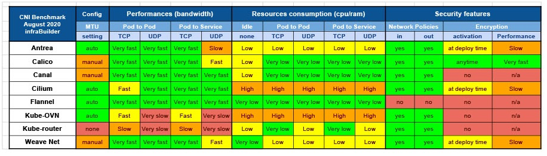
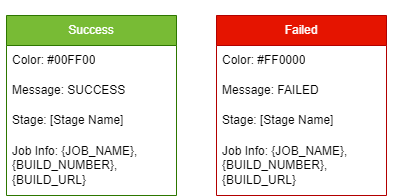
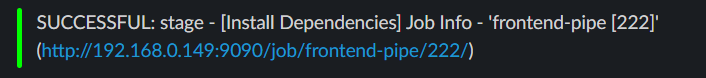
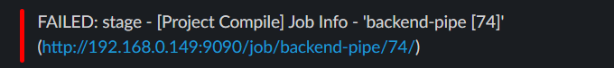

### :sunny: **[플레이 데이터] 한화시스템 BEYOND SW캠프 2기 / Latest** :sunny:

  

## 🤼‍♂️팀원 소개

&nbsp;　&nbsp;　&nbsp;　&nbsp;　&nbsp;　&nbsp;　&nbsp;　&nbsp;　 🐻 **[이동규](https://github.com/PTCman)**&nbsp;　 🦁 **[양호신](https://github.com/Hosae0905)** &nbsp;　 🐶 **[김주연](https://github.com/jyk147369)** &nbsp;　 🐯 **[장대현](https://github.com/poil4291)** &nbsp;
     

## 📌 기술 스택

 

 

    

 상세 기술 스택 

- OS : CentOS 8, Linux
- Container : Docker v26.0.0
- Orchestration : Kubernetes v1.27.12
- CNI : Calico v3.27.0
- CI/CD : Jenkins v2.440.1
- Monitoring : Prometheus, Grafana(dashboard_ID - 315)
- Notification : Slack plugin

 

## 🖥️ Lat32t 운영 환경

- CentOS 8 기반의 리눅스 가상 머신 5대로 구성된 k8s 클러스터를 구축
- Master Node :1대
- Worker Node: 4대
- k8s 클러스터 내부의 Pod 간 통신을 위한 네트워크 플러그인 위해 Calico CNI 설치
- Service 생성시 LoadBalance Type 사용을 위해 Metallb를 설치
- 모니터링 시스템으로 Prometheus와 Grafana 구축
- 같은 네트워크 대역폭을 사용하여 하나의 k8s 클러스터를 구성하기 위해 네트워크 장치로 브릿지를 사용

 

### ✔️ Calico CNI

 Calico CNI를 사용한 k8s 클러스터의 네트워크 성능 테스트 결과

- Calico CNI는 다른 k8s CNI에 비해 자원 소모량이 적어 한정적인 자원을 효율적으로 사용할 수 있다.
- Calico CNI는 비교적 높은 네트워크 성능을 가지고 있어 Pod(kafka, SCDF, DB 등) 간의 통신이 빠르게 이뤄진다.

### 🖥️ 모니터링 시스템
- Prometheus와 Grafana를 이용한 모니터링 시스템 구축
- Prometheus는 k8s 클러스터 내부에서 동작하며, 클러스터 내부의 master 노드와 worker 노드에 설치되어 있는 node-exporter를 통해 metric 데이터를 수집
- Grafana는 Prometheus의 NodePort 주소로 연동하여 metric 데이터를 시각화
- Grafana 대시보드를 통해 클러스터의 상태를 실시간으로 확인 가능 

 

## ✨젠킨스 파이프라인(배포 시나리오)

    

 백엔드 배포 시나리오 

1. 🚀 git push
    - 각 브랜치에서 작업이 끝난 후 PR을 요청하여 develop 브랜치에 push를 진행한다.
2. 🔗 webhook
    - merge가 이뤄지면 14149 포트번호로 포트포워딩 되어 있는 젠킨스 서버로 Webhook이 이뤄진다.
3. 🛠️ Project Clean ~ Project Build
    - 최초 깃허브에서 프로젝트를 clone한 뒤 backend 프로젝트로 이동한다.
    - 먼저 Spring Boot 프로젝트를 clean하여 기존에 존재했던 target 폴더를 지운다.
    - 그 다음 Spring Boot 프로젝트를 compile 하여 target 폴더를 생성한다.
    - target 폴더가 생성되고 난 뒤 mvn test를 통해 테스트를 진행한다.
    - 테스트가 완료된 Spring Boot 프로젝트를 mvn package하여 배포할 수 있는 jar 파일을 생성한다.
4. 📦 Docker Build ~ Docker Push
    - Spring Boot 프로젝트에 포함되어 있는 도커 파일을 바탕으로 docker build를 하여 새로운 버전의 도커 이미지를 생성한다.
    - 생성된 도커 이미지를 docker push 명령어를 통해서 도커 허브에 이미지를 업로드한다.
5. 🚀 Docker Image Push
    - 도커 허브에 이미지를 업로드하게 되면 새로운 버전으로 업로드 된다. ex) lat32t:backend1.x
6. ⚙️ Send Artifacts ~ Modify and Apply Deployment
    - 도커 허브에 이미지를 업로드하는 과정이 성공적으로 완료되면 k8s master 노드의 ssh 서버로 접속하여 기존의 Spring Boot 프로젝트에 있던
백엔드 메니페스트 파일을 옮긴다.
    - k8s master 노드로 옮겨진 백엔드 메니페스트 파일을 kubectl apply 명령어를 통해서 적용시킨다.
7. ⚙️ K8S Deployment Docker Image Update
    - 백엔드 메니페스트 파일이 적용되면 이전에 도커 허브로 올렸던 최신 버전의 도커 이미지를 바탕으로 새로운 Deployment를 생성하게 된다.
8. 💬 Send Slack Alert
    - 앞선 모든 과정에서 성공 및 실패할 시 slack 알림을 보낸다.
 

    

 프론트엔드 배포 시나리오 

1. 🚀 git push
   - 각 브랜치에서 작업이 끝난 후 PR을 요청하여 develop 브랜치에 push를 진행한다.
2. 🔗 webhook
   - merge가 이뤄지면 14149 포트번호로 포트포워딩 되어 있는 젠킨스 서버로 Webhook이 이뤄진다.
3. 🔧 Install Dependencies
    - frontend 폴더로 이동하여 package.json 파일을 바탕으로 npm install을 진행한다.
4. 🛠️ Project Test ~ Project Build
    - npm install 과정이 정상적으로 완료된 뒤 npm run test를 통해 미리 작성한 테스트 코드를 실행한다.
    - 테스트가 정상적으로 완료되면 npm run build를 통해 dist 폴더를 생성해준다. 
5. 📦 Docker Build ~ Docker Push
   - frontend 프로젝트에 포함되어 있는 도커 파일을 바탕으로 docker build를 하여 새로운 버전의 도커 이미지를 생성한다.
   - 생성된 도커 이미지를 docker push 명령어를 통해서 도커 허브에 이미지를 업로드한다.
6. 🚀 Docker Image Push
   - 도커 허브에 이미지를 업로드하게 되면 새로운 버전으로 업로드 된다. ex) lat32t:frontend1.x
7. ⚙️ Send Artifacts ~ Modify and Apply Deployment
   - 도커 허브에 이미지를 업로드하는 과정이 성공적으로 완료되면 k8s master 노드의 ssh 서버로 접속하여 기존의 프론트엔드 프로젝트에 있던
   백엔드 메니페스트 파일을 옮긴다.
   - k8s master 노드로 옮겨진 프론트엔드 메니페스트 파일을 kubectl apply 명령어를 통해서 적용시킨다.
8. ⚙️ K8S Deployment Docker Image Update
   - 프론트엔드 메니페스트 파일이 적용되면 이전에 도커 허브로 올렸던 최신 버전의 도커 이미지를 바탕으로 새로운 Deployment를 생성하게 된다.
9. 💬 Send Slack Alert
   - 앞선 모든 과정에서 성공 및 실패할 시 slack 알림을 보낸다.

    

 Slack 알림 

- 성공과 실패 메시지에 포함되는 내용
  - 슬렉 알림 색깔 ex) Green, Red
  - 성공 및 실패 메시지 ex) SUCCESSFUL, FAILED
  - 어떤 파이프라인 stage에서 발생한 이벤트인지 ex) stage - 'Git Clone'
  - 현재 작업의 이름, 빌드 번호, 빌드 url ex) Job Info - 'frontend-pipe[100]'(http://[Jenkins_URL]) 

- ✅ 성공 메시지  
  - 파이프라인이 성공적으로 완료되었을 때 발생하는 메시지 
  

- ❌ 실패 메시지  
  - 파이프라인이 실패했을 때 발생하는 메시지 
  

