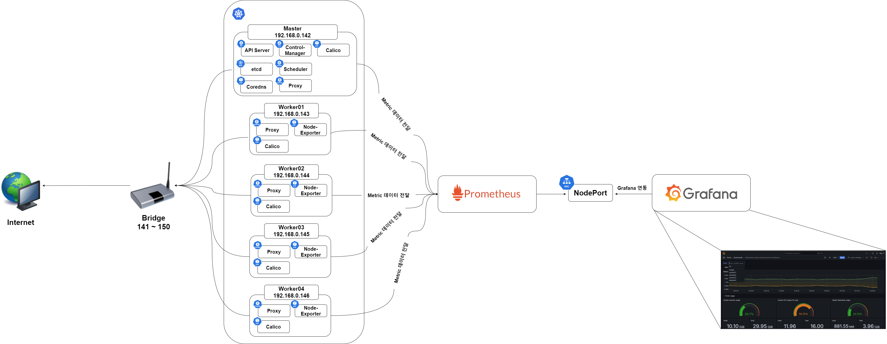
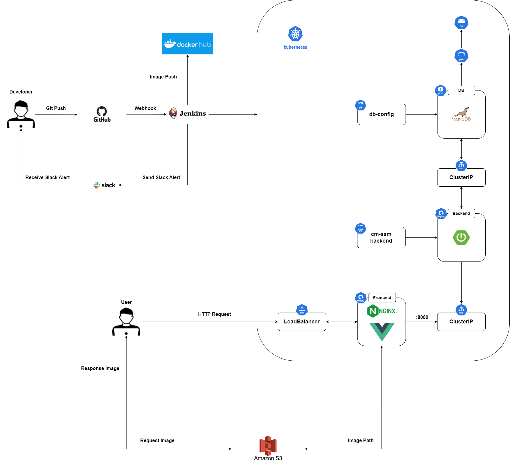

## 🤼‍♂️팀원 소개

  

&nbsp;　&nbsp;　&nbsp;　&nbsp;　&nbsp;　&nbsp;　&nbsp;　&nbsp;　 🐻 **[이동규](https://github.com/PTCman)**&nbsp;　 🦁 **[양호신](https://github.com/Hosae0905)** &nbsp;　 🐶 **[김주연](https://github.com/jyk147369)** &nbsp;　 🐯 **[장대현](https://github.com/poil4291)** &nbsp;
     

## ✔️ 기술 스택
 

 

## 🖥️ Lat32t 운영 환경

    

 k8s 내부 아키텍처 

- k8s 아키텍처 - 클러스터 구성

- Master Node :1대
- Worker Node: 4대
- Node간 Connection을 위해 Calico CNI를 설치
- Service 생성시 LoadBalance Type 사용을 위해 Metallb를 설치
- 모니터링 시스템으로 Prometheus와 Grafana 구축
- 같은 네트워크 대역폭을 사용하여 하나의 k8s 클러스터를 구성하기 위해 네트워크 장치로 브릿지를 사용
 

    

 k8s 전체 서비스 아키텍쳐 

k8s 서비스 아키텍처

## ✨젠킨스 파이프라인(배포 시나리오)

    

 백엔드 배포 시나리오 

1. git merge
    - 각 브랜치에서 작업이 끝난 후 PR을 요청하여 develop 브랜치에 merge를 진행한다.
2. webhook
    - merge가 이뤄지면 14149 포트번호로 포트포워딩 되어 있는 젠킨스 서버로 Webhook이 이뤄진다.
3. Project Clean ~ Project Build
    - 최초 깃허브에서 프로젝트를 clone한 뒤 backend 프로젝트로 이동한다.
    - 먼저 Spring Boot 프로젝트를 clean하여 기존에 존재했던 target 폴더를 지운다.
    - 그 다음 Spring Boot 프로젝트를 compile 하여 target 폴더를 생성한다.
    - target 폴더가 생성되고 난 뒤 mvn test를 통해 테스트를 진행한다.
    - 테스트가 완료된 Spring Boot 프로젝트를 mvn package하여 배포할 수 있는 jar 파일을 생성한다.
4. Docker Build ~ Docker Push
    - Spring Boot 프로젝트에 포함되어 있는 도커 파일을 바탕으로 docker build를 하여 새로운 버전의 도커 이미지를 생성한다.
    - 생성된 도커 이미지를 docker push 명령어를 통해서 도커 허브에 이미지를 업로드한다.
5. Send Artifacts ~ Apply Deployment
    - 도커 허브에 이미지를 업로드하는 과정이 성공적으로 완료되면 k8s master 노드의 ssh 서버로 접속하여 기존의 Spring Boot 프로젝트에 있던
백엔드 메니페스트 파일을 옮긴다.
    - k8s master 노드로 옮겨진 백엔드 메니페스트 파일을 kubectl apply 명령어를 통해서 적용시킨다.
6. K8S Deployment Docker Image Update
    - 백엔드 메니페스트 파일이 적용되면 이전에 도커 허브로 올렸던 최신 버전의 도커 이미지를 바탕으로 새로운 Deployment를 생성하게 된다.
7. Send Slack Alert
    - 앞선 모든 과정에서 성공 및 실패할 시 slack 알림을 보낸다.
    - 성공과 실패 메시지에 포함되는 내용
      - 슬랙 채널 명
      - 슬렉 알림 색깔
      - 성공 및 실패 메시지
      - 어떤 파이프라인 stage에서 발생한 이벤트인지
      - 현재 작업의 이름, 빌드 번호, 빌드 url
 
 

    

 프론트엔드 배포 시나리오 

1. git merge
   - 각 브랜치에서 작업이 끝난 후 PR을 요청하여 develop 브랜치에 merge를 진행한다.
2. webhook
   - merge가 이뤄지면 14149 포트번호로 포트포워딩 되어 있는 젠킨스 서버로 Webhook이 이뤄진다.
3. Install Dependencies
    - frontend 폴더로 이동하여 package.json 파일을 바탕으로 npm install을 진행한다.
4. Project Test ~ Project Build
    - npm install 과정이 정상적으로 완료된 뒤 npm run test를 통해 미리 작성한 테스트 코드를 실행한다.
    - 테스트가 정상적으로 완료되면 npm run build를 통해 dist 폴더를 생성해준다. 
5. Docker Build ~ Docker Push
   - frontend 프로젝트에 포함되어 있는 도커 파일을 바탕으로 docker build를 하여 새로운 버전의 도커 이미지를 생성한다.
   - 생성된 도커 이미지를 docker push 명령어를 통해서 도커 허브에 이미지를 업로드한다.
6. Send Artifacts ~ Apply Deployment
   - 도커 허브에 이미지를 업로드하는 과정이 성공적으로 완료되면 k8s master 노드의 ssh 서버로 접속하여 기존의 프론트엔드 프로젝트에 있던
   백엔드 메니페스트 파일을 옮긴다.
   - k8s master 노드로 옮겨진 프론트엔드 메니페스트 파일을 kubectl apply 명령어를 통해서 적용시킨다.
7. K8S Deployment Docker Image Update
   - 프론트엔드 메니페스트 파일이 적용되면 이전에 도커 허브로 올렸던 최신 버전의 도커 이미지를 바탕으로 새로운 Deployment를 생성하게 된다.
8. Send Slack Alert
   - 앞선 모든 과정에서 성공 및 실패할 시 slack 알림을 보낸다.
   - 성공과 실패 메시지에 포함되는 내용
      - 슬랙 채널 명
      - 슬렉 알림 색깔
      - 성공 및 실패 메시지
      - 어떤 파이프라인 stage에서 발생한 이벤트인지
      - 현재 작업의 이름, 빌드 번호, 빌드 url

