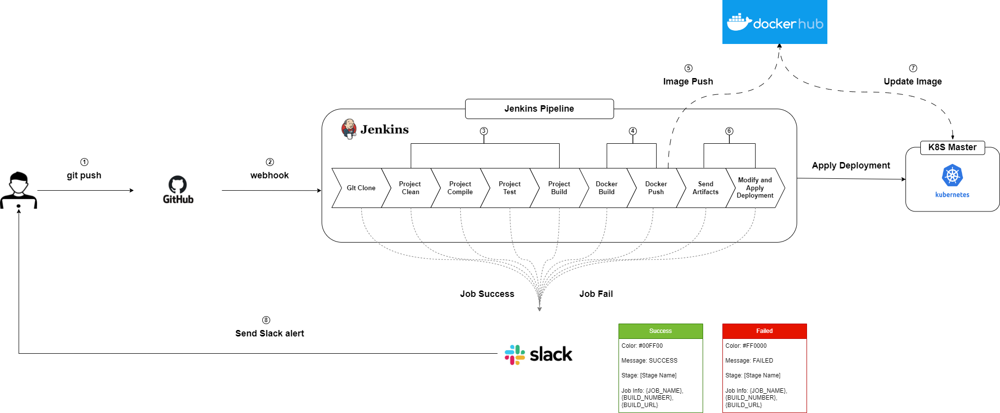
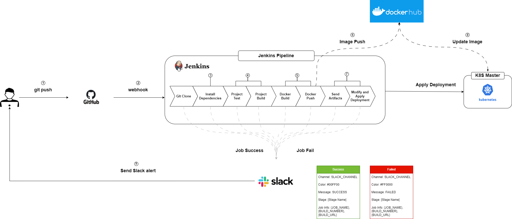

## 🤼‍♂️팀원 소개

  

&nbsp;　&nbsp;　&nbsp;　&nbsp;　&nbsp;　&nbsp;　&nbsp;　&nbsp;　 🐻 **[이동규](https://github.com/PTCman)**&nbsp;　 🦁 **[양호신](https://github.com/Hosae0905)** &nbsp;　 🐶 **[김주연](https://github.com/jyk147369)** &nbsp;　 🐯 **[장대현](https://github.com/poil4291)** &nbsp;
     

## ✔️ 기술 스택
 

 

## 🖥️ Lat32t 운영 환경

    

 k8s 내부 아키텍처 

- k8s 아키텍처 - 클러스터 구성

- Master Node :1대

- Worker Node: 4대

- Node간 Connection을 위해 Calico CNI를 설치

- Service 생성시 LoadBalance Type 사용을 위해 Metallb를 설치
 

    

 k8s 전체 서비스 아키텍쳐 

서비스 아키텍처
User는 Load Balancer Service를 통해 Nginx Server에 접속 가능하다.

## ✨젠킨스 파이프라인(배포 시나리오)

    

 백엔드 배포 시나리오 

1. git push
2. webhook
3. Project Clean ~ Project Build
4. Docker Build ~ Docker Push
5. Docker Image Push
6. Send Artifacts ~ Apply Deployment
7. K8S Deployment Docker Image Update
8. Send Slack Alert

    

 프론트엔드 배포 시나리오 

1. git push
2. webhook
3. Project Clean ~ Project Build
4. Docker Build ~ Docker Push
5. Docker Image Push
6. Send Artifacts ~ Apply Deployment
7. K8S Deployment Docker Image Update
8. Send Slack Alert

