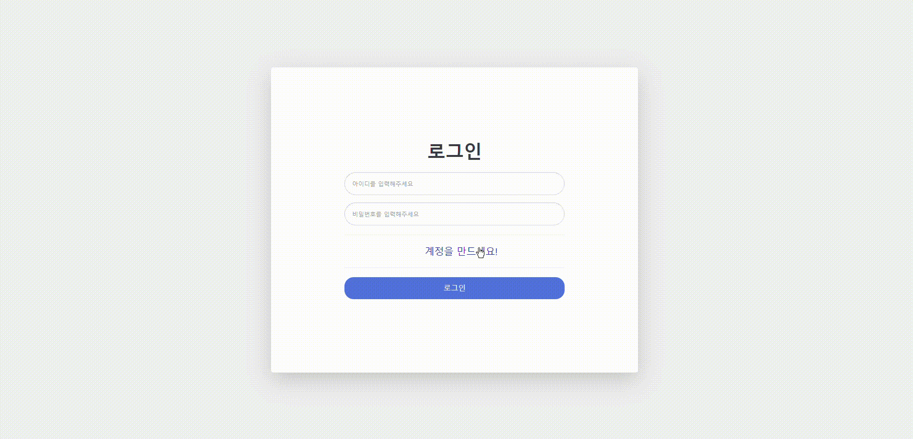
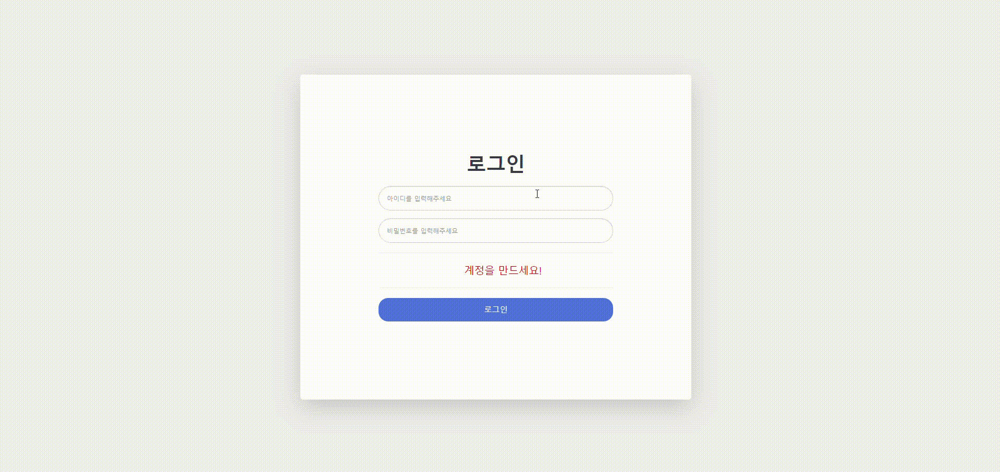
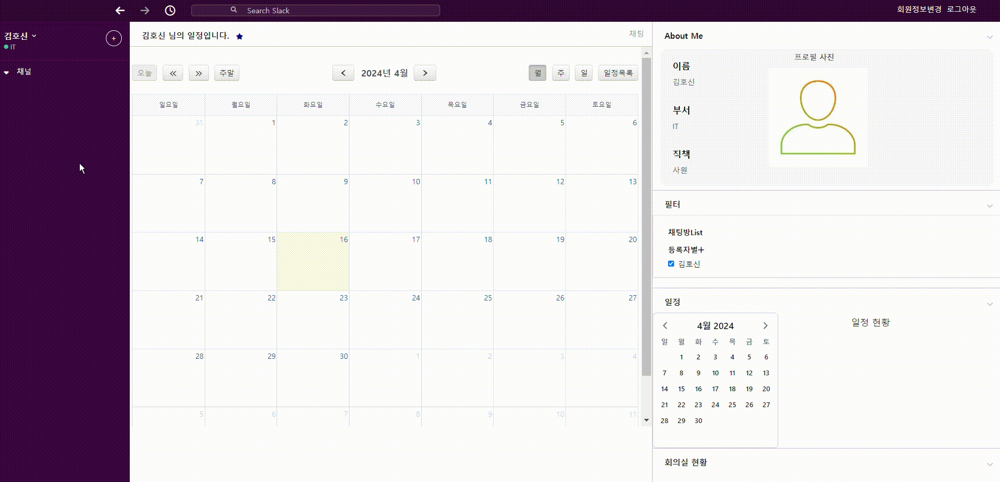
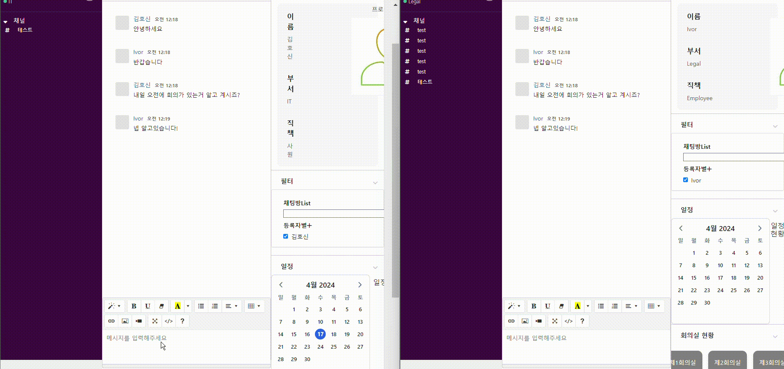
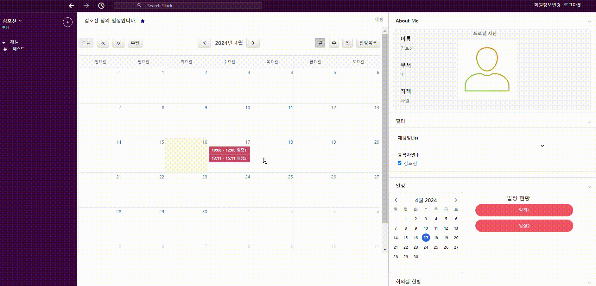
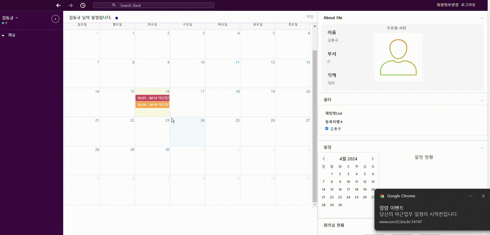
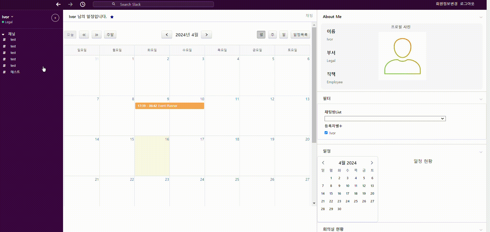

### :sunny: **[플레이 데이터] 한화시스템 BEYOND SW캠프 2기 / Latest** :sunny:

  

## 🤼‍♂️팀원 소개

&nbsp;　&nbsp;　&nbsp;　&nbsp;　&nbsp;　&nbsp;　&nbsp;　&nbsp;　 🐻 **[이동규](https://github.com/PTCman)**&nbsp;　 🦁 **[양호신](https://github.com/Hosae0905)** &nbsp;　 🐶 **[김주연](https://github.com/jyk147369)** &nbsp;　 🐯 **[장대현](https://github.com/poil4291)** &nbsp;

## 📌 기술 스택

 

    

 상세 기술 스택 

- javascript es6
- vue3
- nginx 1.25.4
- jest 27.5.1
- axios 1.6.7
- pinia 2.1.7
- vue-router 4.3.0
- eslint 7.32.0

## :movie_camera: 상세 기능(펼쳐서 확인해주세요)

---

    

 회원가입 

    

 로그인 

    

 채팅방 생성 

    

 채팅 

    

 일정 등록 

    

 회의실 예약 

    

 일정 알람 

    

 채팅 알람 

 
 
